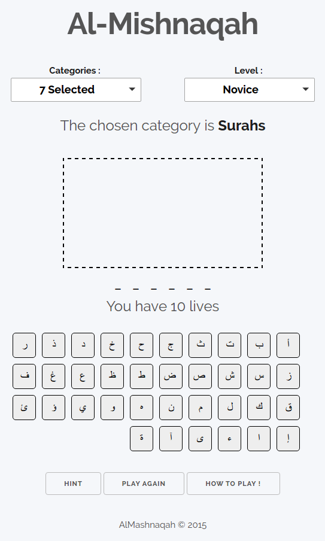

#Hangman

This is a hangman game that was dedicated to Arabic learners, but which can be easily updated and adapted to any other language or purpose through the configuration file data.json.

<b>DEMO : </b>
[<a target="_blank" href="http://htmlpreview.github.io/?https://github.com/undershell/hangman/blob/master/index.html">Arabic Index</a>] - 
[<a target="_blank" href="http://htmlpreview.github.io/?https://github.com/undershell/hangman/blob/master/index_en.html">English Index</a>]
<!--[<a href="http://htmlpreview.github.io/?https://github.com/undershell/hangman/blob/master/hangman/index.html">DEMO</a>]-->

==================

The database is <b>data.js</b>

Each folder contains its resources (img/css/js):
- hangman/ ---> Hangman for Arabic learners
- qhangman/ ---> Hangman based on arabic questions
- versions/ ---> Previous versions
- tools/ ---> Some text tools
- index/ ---> index resources

==================

<h3>Overview</h3>

This is an implementation of the hangman game using HTML/JS/CSS and deploying a json database. it includes :
- Customizable categories with multiple selection
- A hint option
- A responsive interface (Desktop/Mobile)
- Adaptative design
- The possibility of documenting the answers through other websites like dictionaries

  
  

<h3>Perspectives</h3>

The next version will include :
- A new design
- A level system
- A social scorer
- Rich categories and new words
- and other ameliorations ...

<h4>Credits :</h4>
- Based on the HTML framework Skeleton
- JQuery
- JQuery Multiselect Plugin
- JQuery StackBox Plugin
- Free bip sound from soundjay <a href="http://www.soundjay.com/button/button-30.mp3">[1]</a>
- favicon : freeware with allowed commercial usage <a href="http://www.iconarchive.com/show/colorful-long-shadow-icons-by-graphicloads/Book-icon.html">[2]</a>
- a javascript portion by Cathy Dutton under MIT licence
